# 动作与操作描述符

## 操作基本描述符

| 操作描述符 | 含义                         |
|:----------:|------------------------------|
|      c     | change                       |
|      d     | delete                       |
|      y     | 复制到寄存器                 |
|      ~     | 变更大小写                   |
|     g~     | 变更大小写                   |
|     gu     | 变为小写                     |
|     gU     | 变为大写                     |
|     ！     | 通过外部程序过滤             |
|      =     | 缩进                         |
|     gq     | 文本排版                     |
|     g?     | ROT13编码                    |
|      >     | 左移                         |
|      <     | 右移                         |
|     zf     | 定义折叠                     |
|     g@     | 调用'operatorfunc'定义的函数 |

---

## 动作描述符
### 左右移动

|   动作  | 含义                      |
|:-------:|---------------------------|
|    h    | 向左移动[count]字符       |
|    l    | 向右移动[count]字符       |
|    0    | 移动到行首                |
|    ^    | 移动到行第一个非空白字符  |
|    $    | 移动到行尾                |
|    g\_   | 移动到行尾非空白字符      |
|    g0   | 屏幕行的第一个字符        |
|    g^   | 屏幕行的第一个非空白字符  |
|    gm   | 屏幕行中央                |
|    g$   | 屏幕行结尾                |
|    \|   | 移动到当前行[count]屏幕列 |
| f{char} | 移动到右侧{char}上        |
| t{char} | 移动到右侧{char}前        |
| F{char} | 移动到左侧{char}上        |
| T{char} | 移动到左侧{char}前        |
|    ；   | 重复f、F、t、T命令        |
|    ，   | 反方向重复f、F、t、T命令  |

---

### 上下移动命令

|    动作   | 含义                                    |
|:---------:|-----------------------------------------|
|     k     | 向上移动[count]行                       |
|     j     | 向下移动[count]行                       |
|     gk    | 向上移动屏幕行                          |
|     gj    | 向下移动屏幕行                          |
|     -     | 向上移动一行，停在行首非空白字符        |
|     +     | 向下移动一行，停在行首非空白字符        |
|     _     | 向下移动[count-1]行，停在行首非空白字符 |
|     G     | 跳到最后一行                            |
|     gg    | 跳到第一行                              |
|  :[range] | 光标移动动[range]的最后一行             |
|  {count}% | 移动到文件的{count}%处                  |
| [count]go | 移动到文件第[count]字节处               |

---

### 单词动作

| 动作 | 含义                            |
|:----:|---------------------------------|
|   w  | 正向移动[count]个单词           |
|   b  | 反向移动[count]个单词           |
|   W  | 正向移动[count]个字串           |
|   B  | 反向移动[count]个字串           |
|   e  | 正向移动到第[count]个单词尾部   |
|  ge  | 反向移动到第[count]个单词尾部   |
|   E  | 正向移动到第[count]个字串的尾部 |
|  gE  | 反向移动到第[count]个字串尾部   |

---

### 文本对象动作

| 动作 | 含义                |
|:----:|---------------------|
|   (  | 反向 [count] 个句子 |
|   )  | 正向[count]个句子   |
|   {  | 反向[count]个段落   |
|   }  | 正向[count]个段落   |
|  [[  | 反向[count]个小节   |
|  ]]  | 正向[count]个小节   |

---

### 文本对象选择

|    动作    | 含义                                     |
|:----------:|------------------------------------------|
|     aw     | 选择一个单词，包含开头或结尾的空白       |
|     iw     | 选择一个单词不包含空白                   |
|     aW     | 选择一个字串，包含开头或结尾的空白       |
|     iW     | 选择一个字串不包含空白                   |
|     as     | 一个句子                                 |
|     is     | 内含句子                                 |
|     ap     | 一个段落                                 |
|     ip     | 内含段落                                 |
|   a]或a[   | []符号包含的内容，包括符号               |
|   i]或i[   | []符号包含的内容，不包括符号             |
|  a）或a（  | 符号包含的内容，包括符号                 |
|  i）或i（  | 符号内包含的内容，不包括符号             |
|   a>或a<   | 符号包含的内容，包括符号                 |
|   i>或i<   | 符号内包含的内容，不包括符号             |
|   a{或a}   | 符号包含的内容，包括符号                 |
|   i{或i}   | 符号内包含的内容，不包括符号             |
| a"或a'或a` | 符号包含的内容，包括符号                 |
| i"或i'或i` | 符号内包含的内容，不包括符号             |
|     at     | 标签包含的内容，包括标签，eg <a>ssss</a> |
|     it     | 符号内包含的内容，不包括符号             |

---

### 位置标记

|         动作         | 含义                                             |
|:--------------------:|--------------------------------------------------|
|       m{a-zA-Z}      | 放置位置标记                                     |
|     `{a-zA-Z0-9}     | 调转到指定标记                                   |
|  lockmarks {command} | 执行命令 {command}，并且不调整位置标记           |
|          g`          | 在当前缓冲区内跳转时，不改变跳转表               |
|     marks {marks}    | 列出标记                                         |
|   delmarks [marks]   | 删除标记                                         |
|      delmarks！      | 删除所有标记                                     |
|          m`          | 设置前次上下文标记，通过``跳转到这个位置         |
| [range]mark {a-zA-Z} | 把标记设置在[range]的最后一行                    |
|       m< 或 m>       | 改变gv命令的选择范围                             |
|      m[  或  m]      | 设置 '[ 或者 '] 标记                             |
|          `[          | 到上次改变或者抽出的文本的第一个字符             |
|          `]          | 到上次改变或者抽出文本的最后一个字符             |
|          `^          | 到上次插入模式关闭的光标位置                     |
|          `"          | 到上次离开本缓冲区时的光标位置                   |
|          `.          | 到上次改变的位置                                 |
|          `(          | 到当前句子的开始处                               |
|          `)          | 到当前句子的结尾处                               |
|          `{          | 到当前段落的开始处                               |
|          `}          | 到当前段落的结尾处                               |
|         \``          | 到上次跳转的位置                                 |
|          `<          | 到上次当前缓冲区选择的可视区域首行或第一个字符   |
|          `>          | 到上次当前缓冲区选择的可视区域末行或最后一个字符 |
|          ]`          | [count] 次下一个小写位置标记                     |
|          [`          | [count] 次上一个小写位置标记                     |

---

'a - 'z         小写位置标记，在每个文件内有效。

'A - 'Z         大写位置标记，也叫做文件标记，在文件间都有效。

'0 - '9         数字位置标记，在 .viminfo 文件里设置

### 跳转

|    动作    | 含义                                                    |
|:----------:|---------------------------------------------------------|
|   CTRL-O   | 转到跳转表里第 [count] 个较旧的光标位置                 |
|   CTRL-I   | 转到跳转表里第 [count] 个较新的光标位置                 |
|     g;     | 转到改变表里第 [count] 个较旧的位置，包括那些已被撤销的 |
|     g，    | 转到改变表里第 [count] 个较旧的位置，包括那些已被撤销的 |
|    jumps   | 列出跳转表                                              |
| clearjumps | 清除跳转表                                              |

---


### 其他动作
特别适合浏览代码

|    动作    | 含义                                             |
|:----------:|--------------------------------------------------|
|      %     | ([{}])符号匹配跳转                               |
|   [(或 ])  | 反向或者正向未匹配的"(）"                        |
|   [{或 ]}  | 反向或者正向未匹配的"{}"                         |
|     ]m     | 反向向方法开始处                                 |
|     [m     | 正向方法开始处                                   |
|     ]M     | 反向向方法结尾处                                 |
|     [M     | 正向方法结尾处                                   |
|     [#     | 反向第 [count] 个未匹配的 "#if" 或 "#else"       |
|     ]#     | 正向第 [count] 个未匹配的 "#else" 或 "#endif"    |
| [\*  或  [/ | 反向第 [count] 个 C 注释的开始 "/\*"              |
| ]\*  或  ]/ | 正向第 [count] 个 C 注释的结束 "\*/"              |
|      H     | 到窗口从顶部 (Home) 算第 [count] 行              |
|      M     | 到窗口的中间 (Middle) 一行并停在第一个非空白字符 |
|      L     | 到窗口从底部 (Last) 算第 [count] 行              |

---


## 范围（range）

[range]指定了操作的范围。范围可以指操作的行号、位置标记、或是查找模式来指定范围的开始位置和结束位置

## 用行号作为地址
 光标移动到该数字所指定的行上,例如
-  ：1      //移动到文件第一行
-  ：$      //移动到文件最后一行
-  ：.       //当前行


## 用地址指定一个范围

范围的格式如下：

：{start}，{end}

---

{start} 和{end} 都是地址，这里的地址可以是行号，也可以是查找模式或者位置标记,例如

-  ： .，$    //从当前行到结尾 
-  ： %       //代表当前文件所有行
-  ： 'm      //包含位置标记m 的行

## 用高亮选区指定范围

进入Visual模式，高亮选中范围后，按下：后命令行上回预填充一个范围：'<,'>，代表高亮选区的范围，这些位置标记即使在退出可视模式后仍然存在

## 用模式指定范围
：/pattern1/,/pattern2/通过模式指定一个范围，虽然负载但是它符合范围的一般形式:{start},{end}，例如: /<html>/,/<\\/html>/,指定了html标签内的范围

## 偏移地址修正
偏移的一般形式是这样的：

:{address}+n

---

{address} 可以是一个行号、一个位置标记，或是一个查找模式

例如：
- /<html>/+1,/<\/html>/-1
- .,.+3


# 解决问题的方式

## .命令
1. 重复上次修改
2. 从进入插入模式到推出,vim会记录这个过程中的修改
3. 在插入模式每次方向键操作,会产生一个新的撤销块

## 减少无关操作

| 复合命令 | 等效命令 | 含义               |
|:--------:|:--------:|--------------------|
|     C    |    c$    | 删除当前字符至结尾 |
|     s    |    cl    | 删除当前字符       |
|     S    |    ^c$   | 删除当前行         |
|     I    |    ^i    | 在行首进入插入模式 |
|     A    |    $a    | 在行尾进入插入模式 |
|     o    |  $a<CR>  | 在下方新建一行     |
|     O    |  k$a<CR> | 在上方新建一行     |

## 重复操作及回退

|     目的     |               操作              | 重复 | 回退 |
|:------------:|:-------------------------------:|:----:|:----:|
|   做出修改   |              {edit}             |   .  |   u  |
| 行内查找字符 | f{char}/F{char}/t{char}/T{char} |   ;  |   ,  |
|   查找匹配   |    /pattern<CR>/?pattern<CR>    |   n  |   N  |
|   执行替换   |      :s/target/replacement      |   &  |   u  |
|  执行宏操作  |           qx{changes}q          |  @x  |   u  |

## 查找和手动替换

\*命令可以对光标所在的单词进行查找,n跳到下一个匹配项，.实现重复修改

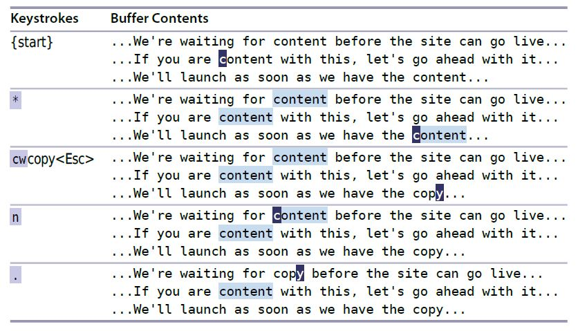

# 模式

## 普通模式

### 控制撤销操作的粒度

1. 从进入插入模式到退出时一次修改，视为一个撤销块
2. 在插入模式按方向键将产生一个撤销块

### 构造可重复的修改

### 用次数做简短的运算

| 命令                | 功能                     | note     |
|---------------------|--------------------------|----------|
| [count] &lt;C-x&gt; | 在当前行数字上做减法运算 | 普通模式 |
| [count] &lt;C-a&gt; | 在当前行数字上做加法运算 | 普通模式 |

## 插入模式

### 在插入模式即时更正错误

| 按键操作    | 用途           |
|-------------|----------------|
| &lt;C-h&gt; | 删除前一个字符 |
| &lt;C-w&gt; | 删除前一个单词 |
| &lt;C-u&gt; | 删除至行首     |


### 返回普通模式

| 按键操作    | 用途                |
|-------------|---------------------|
| &lt;C-\[&gt; | 切换到普通模式      |
| &lt;C-o&gt; | 切换到插入-普通模式 |


### 插入模式粘贴寄存器文本

| 按键操作     | 用途             |
|--------------|------------------|
| &lt;C-r&gt;0 | 粘贴寄存器内文本 |

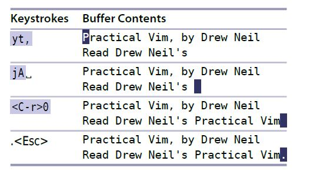

### 在插入模式运算

| 按键操作     | 用途       |
|--------------|------------|
| &lt;C-r&gt;= | 计算表达式 |

### 用字符编码插入非常用字符

| 按键操作                  | 用途                   |
|---------------------------|------------------------|
| &lt;C-v&gt;{123}          | 以十进制插入字符       |
| &lt;C-v&gt;u{123}         | 以十六进制插入字符     |
| &lt;C-k&gt;{char1}{char2} | 插入二合字母表示的字符 |


```
<C-v>065
<C-v>u00bf
<C-k>?I
```

### 替换字符

| 命令 | 功能         |
|------|--------------|
| R    | 进入替换模式 |
| r    | 替换单独字符 |

## 可视模式

### 激活可视模式

| 命令        | 用途               |
|-------------|--------------------|
| v           | 面向字符的可视模式 |
| V           | 面向行的可视模式   |
| &lt;C-v&gt; | 面向列的可视模式   |
| gv          | 重选上次高亮选区   |
| o           | 切换选区的活动端   |

### 面向列的可视模式

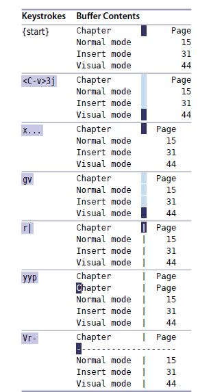


插入多行文本

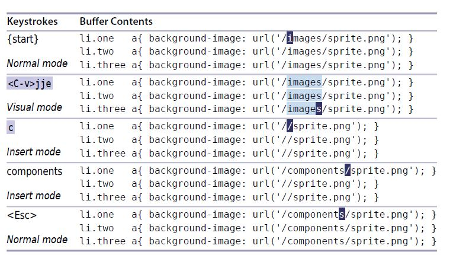


在长短不一的文本后添加文本

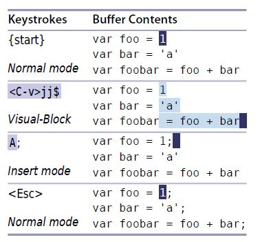


## 命令行模式

### 操作缓冲区的Ex命令


| 命令                                          | 用途                                               |
|-----------------------------------------------|----------------------------------------------------|
| :[range]delete [x]                            | 删除指定范围内的行到寄存器x                        |
| :[range]yank [x]                              | 复制指定范围的行到寄存器x                          |
| :[line]put [x]                                | 在指定行后粘贴寄存器x的内容                        |
| :[range]copy {address}                        | 把指定范围内的行拷贝到address指定的行之下，简写为t |
| :[range]move {address}                        | 把指定范围内的行移动到address指定的行之下，简写为m |
| :[range]join                                  | 连接指定范围内的行                                 |
| :[range]normal {commands}                     | 在指定范围内的每一行执行普通模式命令               |
| :[range]substitute/{pattern}/{string}/[flags] | 在指定范围内执行替换操作                           |
| :[range]global/{pattern}/[cmd]                | 对指定范围内匹配{pattern}的所有行执行命令          |
| :[range]print                                 | 打印指定范围的文本                                 |


### 指定范围上执行普通命令

normal在执行普通模式命令前，会把光标移动到起始处

- %normal A;   在每一行的末尾添加分号
- %normal i//  在每一行的开始位置加入注释符号
- %normal .    在每一行执行上次的操作
- %nornal @q   在每一行执行宏 

### 重复上次的Ex命令

- @: 重复上次的Ex命令
- @@ ： 使用@:重复完上次命令后，可以使用@@重复上次的Ex命令

### 插入光标出单词
 - &lt;C-r&gt;&lt;C-w&gt; 将光标出的词插入到命令行中

### 命令行窗口

| 命令        | 动作                         |
|-------------|------------------------------|
| q/          | 打开查询历史窗口             |
| q:          | 打开查询Ex命令窗口           |
| &lt;C-f&gt; | 从命令行模式切换到命令行窗口 |

### 与shell交互

| 命令                | 用途                                                                             |
|---------------------|----------------------------------------------------------------------------------|
| read !{cmd}         | 把命令的输出内容读取到当前缓冲区                                                 |
| [range]write !{cmd} | 把缓冲区的内容作为cmd的标准输入                                                  |
| !{cmd}              | 在shell中执行cmd                                                                 |
| :[range]!{filter}   | 把指定的范围的内容作为filter内容的标准输入，同时filter的输出替换到指定范围的内容 |

# 文件

## 管理多个文件

### 缓冲区列表

| 命令                            | 作用                     |
|---------------------------------|--------------------------|
| ls                              | 列出缓冲区列表           |
| bnext                           | 查看下一个缓冲区         |
| bprev                           | 查看上一个缓冲区         |
| buffer N                        | 跳转到指定的缓冲区       |
| bfirst                          | 跳转到第一个缓冲区       |
| blast                           | 跳转到最后一个缓冲区     |
| bufdo                           | 在每一个缓冲区执行Ex命令 |
| bdelete N1 N2 N3或者N,M bdelete | 删除缓冲区               |
| &lt;C-f&gt;                     | 在轮替缓冲区间快速跳转   |

缓冲区跳转快捷键

| 快捷键 | 作用                 |
|--------|----------------------|
| [b     | 跳转到上一个缓冲区   |
| ]b     | 跳转到下一个缓冲区   |
| [B     | 跳转到第一个缓冲区   |
| ]B     | 跳转到最后一个缓冲区 |

参数列表快捷键

| 快捷键 | 作用                 |
|--------|----------------------|
| [a     | 跳转到参数列表上一项 |
| ]a     | 跳转到参数列表下一项 |

quick fix列表

| 快捷键 | 作用                       |
|--------|----------------------------|
| [q     | 跳转到quickfix列表的上一项 |
| ]q     | 跳转到quickfix列表的下一项 |

位置列表
| 快捷键 | 作用                 |
|--------|----------------------|
| [l     | 跳转到位置列表上一项 |
| ]l     | 跳转到位置列表下一项 |

标签列表

| 快捷键 | 作用                 |
|--------|----------------------|
| [t     | 跳转到标签列表上一项 |
| ]t     | 跳转到标签列表下一项 |

### 参数列表

| 命令  | 作用                         |
|-------|------------------------------|
| args  | 列出参数列表                 |
| next  | 跳转到参数列表上一项         |
| prev  | 跳转到参数列表下一项         |
| argdo | 在列表中的每个缓冲区执行命令 |


### 分割窗口

| 命令              | 用途                 |
|-------------------|----------------------|
| &lt;C-w&gt;s      | 水平分割窗口         |
| &lt;C-w&gt;v      | 垂直分割窗口         |
| sp {file}         | 水平分割窗口         |
| vsp {file}        | 垂直分割窗口         |
| &lt;C-w&gt;w      | 窗口间循环切换       |
| &lt;C-w&gt;h      | 切换到左边窗口       |
| &lt;C-w&gt;j      | 切换到下边窗口       |
| &lt;C-w&gt;k      | 切换到上边窗口       |
| &lt;C-w&gt;l      | 切换到右边窗口       |
| &lt;C-w&gt;c      | 关闭活动窗口         |
| close             | 关闭活动窗口         |
| &lt;C-w&gt;o      | 只保留当前活动窗口   |
| only              | 只保留当前活动窗口   |
| &lt;C-w&gt;=      | 使所有窗口等高、等宽 |
| &lt;C-w&gt;+      | 窗口高度增加1行      |
| &lt;C-w&gt;-      | 窗口高度减少1行      |
| &lt;C-w&gt;\_     | 最大化高度           |
| &lt;C-w&gt;\|     | 最大化宽度           |
| [N] &lt;C-w&gt;\_ | 窗口高度设置为N行    |
| [N] &lt;C-w&gt;\| | 窗口宽度设置为N列    |
| &lt;C-w&gt;r      | rotate all windows   |
| &lt;C-w&gt;x      | 交换相邻的窗口       |
| &lt;C-w&gt;[HJKL] | 移动窗口到[左下上右] |


### 用标签页将窗口分组

| 命令               | 用途                     |
|--------------------|--------------------------|
| tabedit {filename} | 在新标签页打开           |
| tabc[lose]         | 关闭当前标签页           |
| tabo[nly]          | 只保留当前标签页         |
| &lt;C-w&gt;T       | 将当前窗口移动到新标签页 |

在标签页间切换
| 命令          | 按键   | 用途                                            |
|---------------|--------|-------------------------------------------------|
| tabn[ext] {N} | {N} gt | 切换到编号为{N}的标签页                         |
| tabn[ext]     | gt     | 切换到下一个标签页                              |
| tabp[revious] | gT     | 切换到上一个标签页                              |
| tabmove [N    |        | 重排标签页，N为0时移动到开头，省略N时移动到结尾 |


## 打开及保存文件

### 使用netrw管理文件系统

| 命令        | 作用               |
|-------------|--------------------|
| e           | 打开文件           |
| E           | 打开目录           |
| &lt;C-^&gt; | 在文件和目录间切换 |

### 把文件保存到不存在的目录

:mkdir -p %:h

- % 会展开为文件所在的完整路径
- %:h 展开文件所在的完整路径，但是除去文件名

### 以root账户保存文件

: w !sudo tee % > /dev/null

# 更快地移动及跳转

## 通过查找进行移动

- 查找可以进行快速移动
- 查找可以用在操作待决模式

## 在文件间跳转

### 遍历跳转列表

| 命令        | 用途             |
|-------------|------------------|
| &lt;C-o&gt; | 在跳转列表中后退 |
| &lt;C-i&gt; | 在跳转列表中前进 |
| ``          | 调回上次位置     |
| jumps       | 显示跳转列表     |


### 遍历改变列表

| 命令    | 用途             |
|---------|------------------|
| changes | 显示改变列表     |
| g;      | 正向遍历改变列表 |
| g,      | 反向遍历改变列表 |
| `.      | 上次改变的位置   |
| `^      | 上次插入的位置   |

### 跳转到光标下的文件

| 命令        | 用途                     |
|-------------|--------------------------|
| gf          | 跳转到光标下的文件       |
| &lt;C-]&gt; | 跳转到光标下关键字定义处 |


## 寄存器

| 操作 | 作用               |
| xp   | 交换相邻的两个字符 |
| ddp  | 交换当前行和下一行 |
| yyp  | 创建当前行的副本   |

### 引用寄存器

 "{register}  通过该方式引用寄存器

- "add 删除的内容放到寄存器a
- "Add 删除的内容追加到寄存器a
- "byy 复制的内容放入寄存器b
- "bp  粘贴寄存器b中的内容
- qaq  清空寄存器

### 显示寄存器内容

:reg "{register} 显示寄存器内容

### 特殊寄存器

| 寄存器名称 | 作用                                                          |
|------------|---------------------------------------------------------------|
| \"\"       | 无名寄存器,在未指定明确指定寄存器时使用该寄存器               |
| \"0        | 复制专用寄存器，使用y{motion}命令时，默认会往该寄存器存入副本 |
| \"{a-z}    | 有名寄存器                                                    |
| \"\_       | 黑洞寄存器                                                    |
| \"=        | 表达式寄存器                                                  |
| \"%        | 当前文件名，只读                                              |
| \"#        | 轮换文件名，只读                                              |
| \"\.       | 上次插入文本,只读                                             |
| \":        | 上次执行的Ex命令 ，只读                                       |
| \"/        | 上次查找模式，只读                                            |

## 宏

### 录制宏

q键既是录制按钮也是停止按钮，q{register}指定一个用于保存宏的寄存器

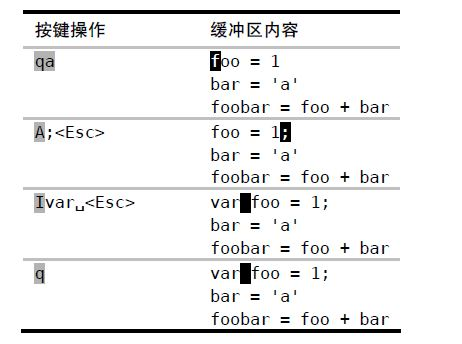

### 播放宏

使用[count]@{register}命令播放宏，@@重复最近的宏

:argdo normal @{register}可以在每个文件中执行宏

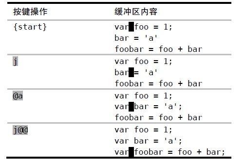

### 修改宏

1. 将宏粘贴到文档
   - G  跳转到文件结尾
   - put a 粘贴a寄存器内容
2. 修改宏的内容
3. 保存到寄存器中
   - 0 跳转到开始
   - "ay$ 宏内容放置到寄存器中

# pattern

## 模式匹配

### patter特性开关

| 关键字 | 作用                             | 例子                                         |
|--------|----------------------------------|----------------------------------------------|
| \\c    | 忽略大小写                       | \\cfoo---> foo Foo FOO                       |
| \\C    | 大小写敏感                       | foo\\C---> foo                               |
| \\v    | very magic模式，特殊字符不用转义 | /\v#([0-9a-fA-F]{6}\|[0-9a-fA-F]{3})--->#089 |
| \\V    | very nomagic模式，按文本原义查找 | /\Va.k.a.---> . \* ?不需要转义               |

### 使用圆括号捕获子匹配
 
```
/\v<(\w+)\_s+\1>  匹配重复单词，例如 I love Paris in *the the* springtime

\v 激活very magic模式
<> 确定单词边界
\_s 空白字符
\1 圆括号子匹配
```

### 界定匹配的边界

 - 模式: 在查找与输入的正则表达式
 - 匹配: 文本中被高亮显示的文本
 - \\zs和\\ze可以对匹配进行剪裁

 例子:

 /Practical \zsVim   -------> 搜索文本中的Practical Vim但是只有Vim高亮

 

 ```
 [^"]+ 除双引号外的其他字符

 ```

## 查找

| 命令        | 用途           |
|-------------|----------------|
| /str        | 正向查找       |
| ?str        | 反向查找       |
| n           | 跳转到下一匹配 |
| N           | 跳转到上一匹配 |
| /&lt;Up&gt; | 浏览查找记录   |


## 替换

命令语法

---
:[range] s[ubstitute]/{pattern}/{replace-string}/{flags}
---

flags标志位

| flag | 作用                         |
|------|------------------------------|
| g    | 在一行全局范围内             |
| c    | 替换前确认                   |
| n    | 不执行替换，只报告匹配的个数 |
| &    | 重用上一次的标志位           |


替换域的特殊字符

| 符号            | 描述                               |
|-----------------|------------------------------------|
| \\r             | 插入换行符                         |
| \\t             | 插入制表符                         |
| \\\\            | 插入反斜杠                         |
| \1              | 插入第1个子匹配                    |
| \2              | 插入第2个自匹配                    |
| \0              | 插入匹配的所有内容                 |
| ~               | 使用上一次调用substitute时的string |
| \\={Vim script} | 执行脚本，返回的结果作为替换string |


### 重用上次的查找模式

将查找命令的查找域留空意味着vim将会使用上次的查找模式

### 用寄存器内容替换

- :%s//&lt;C-r&gt;0/g
- :%s//\=@0/g      
  
  用@{register}返回寄存器内容，@0引用复制寄存器中内容  @"引用无名寄存器中的内容

### 重复上次的查找命令

- :%s//~/&

### 使用子匹配重排CSV文件的字段

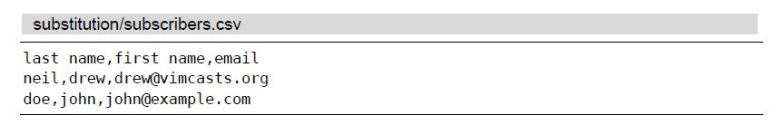

```
:/\v^([^,]*),([^,]*),([^,]*)$      [^,]*除逗号外的其他字符

:%s//\3,\2,\1
```

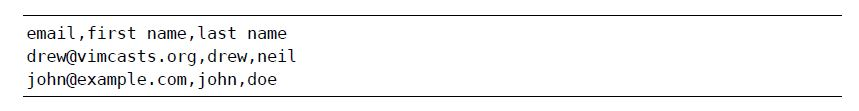


## global命令

在匹配的pattern上执行Ex命令,print是global缺省的cmd

命令通用模式

---
:[range] global[!] /pattern/ [range] [cmd]
---

### 删除所有包含模式的文本行

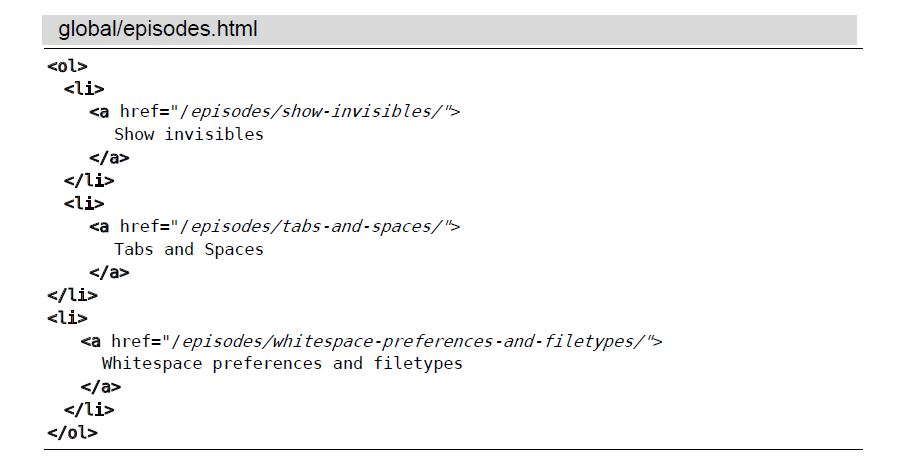

```
:/\v\<\/?\w+>
:g//d

```
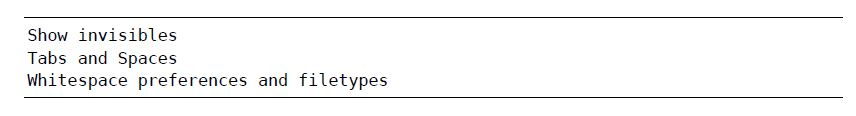


### 将TODO项收集到寄存器

```
 qaq                    清空寄存器a
 :g/TODO/yank A         将内容追加到寄存器A
```

```
qaq                    清空寄存器a
:g/TODO/t$             将内容拷贝到文件结尾
```

### 动态指定命令命令的作用范围

我们可用使用 g/{pattern}  作为参考点，为cmd动态设定范围

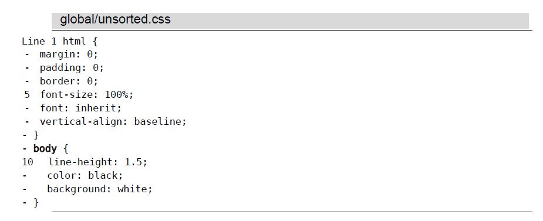

```
:g/{/ .+1,/}/-1 sort
```

# 工具

## ctags工具

| 命令             | 用途                                       |
|------------------|--------------------------------------------|
| &lt;C-]&gt;      | 跳到关键字的第一个匹配标签处               |
| g&lt;C-]&gt;     | 存在多个匹配时跳到关键字的第一个匹配标签处 |
| tag {keyword}    | 跳转到匹配的第一个标签                     |
| tjump {keyword}  | 存在多个匹配时，选择匹配                   |
| pop或&lt;C-t&gt; | 反向遍历标签                               |
| tag              | 正向遍历标签                               |
| tnext            | 跳转到下一处匹配                           |
| tprev            | 跳转到上一处匹配                           |
| tfirst           | 跳转到第一处匹配                           |
| tlast            | 跳转到最后一处匹配                         |
| tselect          | 提示用户从标签匹配列表中选择一项           |


## quickfix 列表

| 命令   | 用途             |
|--------|------------------|
| copen  | 打开quickfix窗口 |
| cclose | 关quickfix窗口   |
| cc N   | 跳转到第N项      |
| cnext  | 下一项           |
| cprev  | 上一项           |
| cfirst | 第一项           |
| clast  | 最后一项         |
| cnfile | 下一个文件       |
| cpfile | 上一个文件       |

### 回溯以前的quickfix列表
| 命令   | 用途                             |
|--------|----------------------------------|
| colder | 回溯之前的某个版本的quickfix列表 |
| cnewer | 反向                             |


## 自动补全


